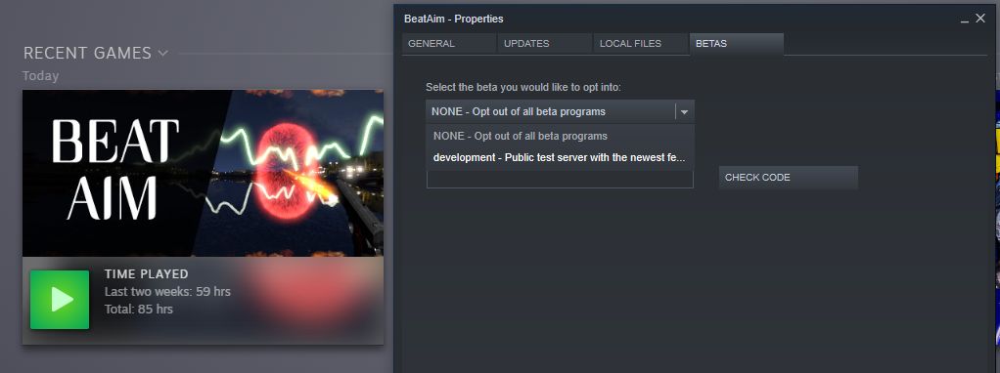

# BeatAim
https://BeatAim.com

Hey, this is our website but also a place to let you and the whole community to change and improve the game. Currently available used files that can be modified:
- [Difficulty settings for all of the songs in the game](./gameDevBranch/SongsBalance.csv) - slightly easier to edit version is available on [google.com/spreadsheets](https://docs.google.com/spreadsheets/d/1-xiFWjoz_gJpaMbiVgTNn0hJUg151I3ph4QplFCayUo/edit?usp=sharing) comments are enabled

# Development of BeatAim
The game was created by only one person ([Kamyker](https://twitter.com/kamyker)). That's why I invite everyone to help me. The most active users will be granted with unlimited VIPs and a lot more if game gets popular and successful. Not only designers are needed but also artists and testers.

BeatAim has 2 branches on Steam:
1. default - main game that is supposed to be bug-free and a place for tournaments, updated every 1-2 weeks
2. development - here we will be experimenting, adding new features, testing and so on, updated every 1-2 days

That's probably the best way to have a solid but also rapidly improving game. Every major bug that wasn't noticed on Dev branch will be instantly patched on the Main. Whole Dev branch will be pulled to Main every week. If any major changes happen to the game difficulty leaderboard will be reset. Every top player will get some kind of prize. I'll also implement automatic leaderboards/tournaments system that will calcualte scores, select and reward best aimers.

To help testing and try the newest features, go to game properties on Steam and join beta: 

